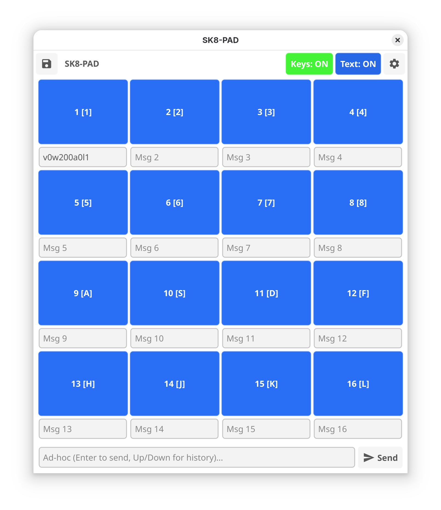

# `sk8-pad` - a 4x4 trigger pad for `skred`


*flexible drum machine like pads*

# quick

```
# install go1.25.5 and fyne
# go install fyne.io/tools/cmd/fyne@latest
cd src
make
./build/TARGET/sk8-pad
```


